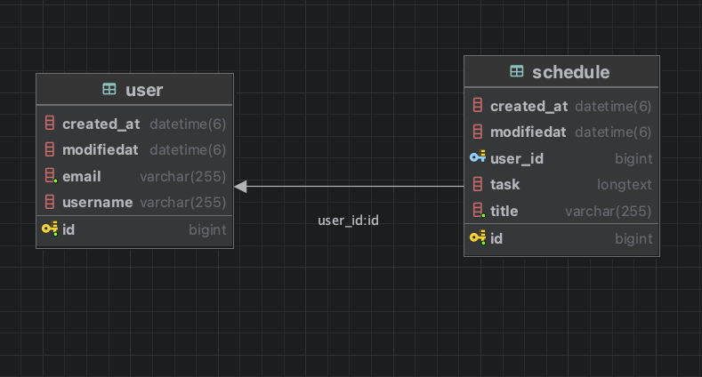

# [SPRING 6기] Calendar 과제
-----

## 프로젝트 소개
"JPA를 활용해서 구현해보자"
***

## 프로젝트 개발 기간
'2025. 03. 27(목) ~ 2025. 04. 04(금)"
***

## 프로젝트 프래그램 설치방법 및 환경세팅
1. JDK 버전 17
***

## 주요 기능
* 일정 등록하기 (@RequestBody 어노테이션을 활용하여 DB에 저장)
* 등록 시 id 값을 pk로 설정 후 @GeneratedValue 전략으로 IDENTITY를 설정하여 값이 자동으로 1씩 증가
* 모든 일정 조회 (DB에 저장된 모든 일정을 조회하는 기능 구현)
* 일정 수정하기
* 일정 삭제하기
* User 회원가입 기능 구현
* User 테이블과 Schedule 테이블의 연관관계 설정 (ManyToOne 으로 N의 관계에 있는 Schedule의 user_id 값으로 join)
* 로그인 기능 구현 (회원가입한 email과 password 정보가 입력받은 값과 일치하는지 확인)
* 로그인정보가 세션에 있지 않을 때, 다른 메서드들 사용 불가.
***

## API 명세서
| 기능       | Method | URL            | Request                                                    | Response                                                                                                                             | Status Code |
|:---------|:-------|:---------------|:-----------------------------------------------------------|:-------------------------------------------------------------------------------------------------------------------------------------|:------------|
| 일정 등록    | POST   | /schedules     | {"title": "제목","todo": "할일","name": "작성자","password": 1234}| {"id": 1,"title": "제목","todo": "할일","name": "작성자","createDate": "YYYY-mm-dd T HH:MM:SS","updatedDate": "YYYY-mm-dd T HH:MM:SS"}      | 201 Created |
| 일정 목록 조회 | GET    | /schedules     |                                                            | [{"id": 1,"title": "제목","todo": "할일","name": "작성자","createDate": "YYYY-mm-dd T HH:MM:SS","updatedDate": "YYYY-mm-dd T HH:MM:SS"}]    | 200 OK      |
| 일정 수정    | PUT    | /schedule/{id} | {"todo": "수정 내용","name": "수정 이름","password": 1234}         | {"id": 1,"title": "제목","todo": "수정 내용","name": "수정 이름","createDate": "YYYY-mm-dd T HH:MM:SS","updatedDate": "YYYY-mm-dd T HH:MM:SS"} | 200 OK      |
| 일정 삭제    | DELETE | /schedule/{id} | {"password": 1234}                                         |                                                                                                                                      | 200 OK      |
| 회원 가입    | POST   | /users/signup  | {"username": "이름","email": "email","password": "1234"}     | {"id": 1,"username": "이름","email": "email","createdAt": "YYYY-mm-dd T HH:MM:SS","modifiedAt": "YYYY-mm-dd T HH:MM:SS"}               | 201 Created |
| 유저 단건 조회 | GET    | /users/{id}    |                                                            | {"id": 1,"username": "이름","email": "수정된 이메일","createdAt": "2025-04-03T16:50:03.344283","modifiedAt": "2025-04-03T16:50:12.489725"}   | 200 OK      |
| 유저 정보 수정 | PUT    | /users/{id}    | {"email": "수정된 이메일"}                                       || 200 OK      |
| 유저 삭제    | DELETE | /users/{id}    |                                                            || 200 OK      |
| 로그인      | POST   | /users/login   | {"email": "email","password": "1234"}                      |로그인 성공!| 200 OK      |
***

## ERD

***

## 트러블 슈팅
* https://myinfo0968.tistory.com/47
***

## 결과 및 성과
* Spring 에서 사용하는 어노테이션 사용법
* session을 사용하여 로그인 정보 유지
* 필터 사용법(필터로 로그인 하지 않으면 다른 URL 접속 차단)
* JPA의 이해 및 사용법
